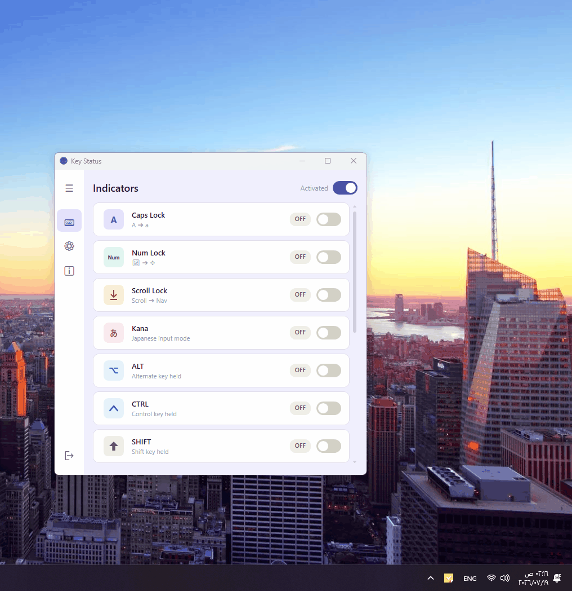
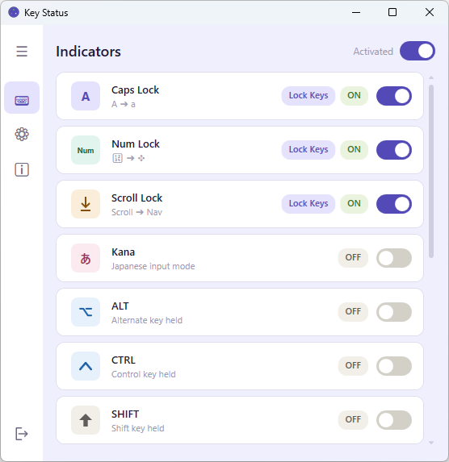
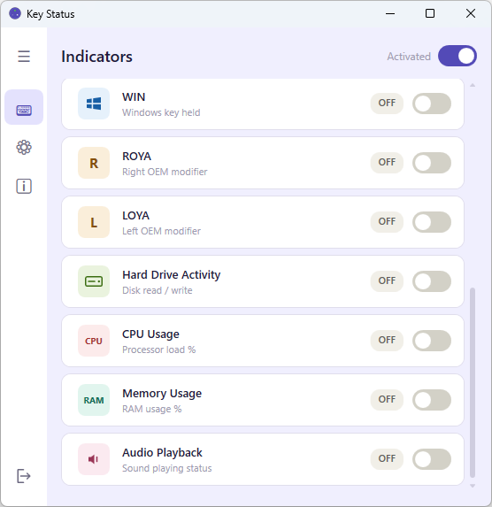
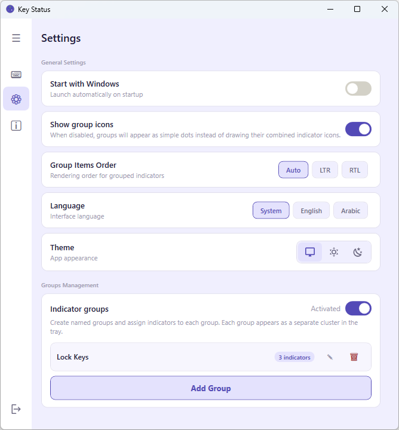
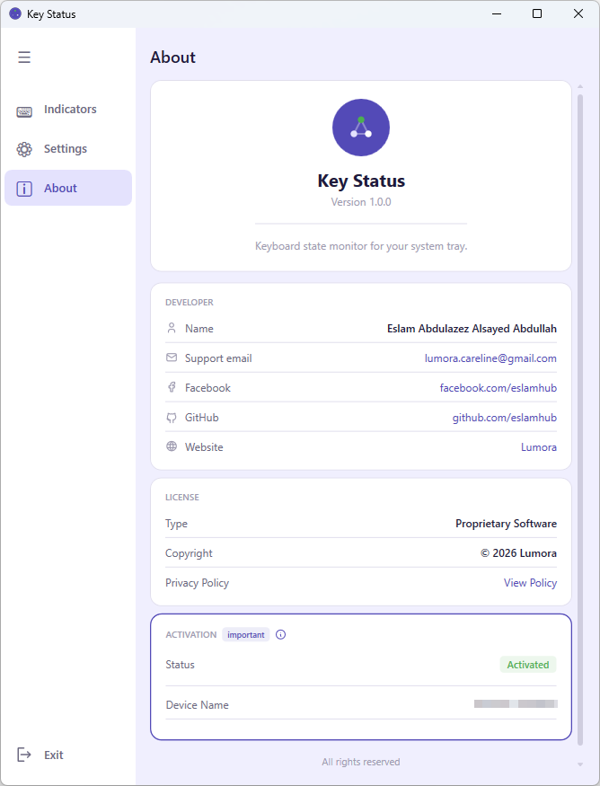
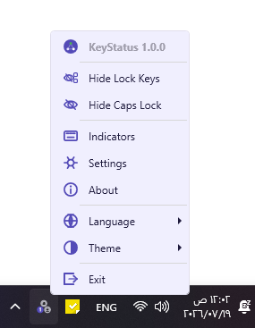
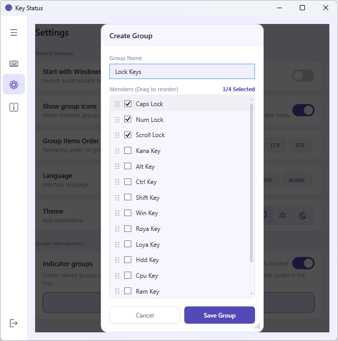
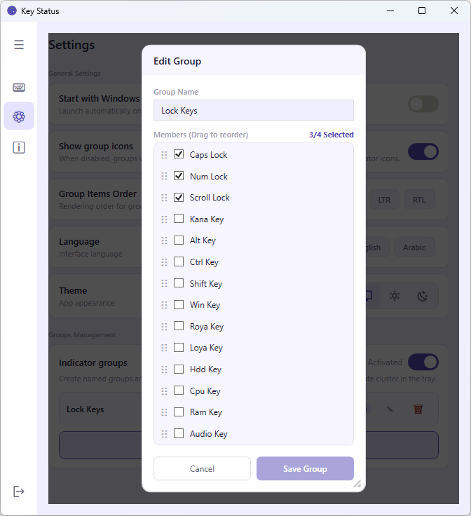

# ⌨️ Key Status

**Keyboard & system state monitor for your Windows system tray.**

Most laptops and compact keyboards have no LED indicators for `Caps Lock`, `Num Lock`, or `Scroll Lock`. Key Status shows you the real-time state of these keys — and more — right next to your clock, with zero typing required to check.

---

## 📋 Overview

| | |
|---|---|
| **App** | Key Status |
| **Version** | 1.0.0 (first release) |
| **Platform** | Windows |
| **Type** | System tray utility |
| **Developer** | Eslam Abdulazez Alsayed Abdullah |
| **Brand** | Lumora |

---

## ✨ Features

### 14 Indicators
| Indicator | Shows |
|---|---|
| Caps Lock | ON/OFF state of capital letters lock |
| Num Lock | Numeric keypad mode |
| Scroll Lock | Scroll lock state |
| Kana | Japanese input mode |
| Alt | Whether Alt is currently held |
| Ctrl | Whether Ctrl is currently held |
| Shift | Whether Shift is currently held |
| Win | Whether the Windows key is currently held |
| Roya | Right OEM modifier key |
| Loya | Left OEM modifier key |
| Hard Drive | Disk read/write activity |
| CPU | Processor load % |
| RAM | Memory usage % |
| Audio | Whether sound is currently playing |

### System Tray & Context Menu
- **Live icons** next to the clock reflect each indicator's real-time state.
- **Double-click** a single indicator → toggles it ON/OFF (lock keys) or refreshes its reading (CPU/RAM, etc.).
- **Double-click inside a group** → precise hit detection triggers the action for only the specific indicator you clicked, not the whole group.
- **Right-click menu:**
  1. App title
  2. Smart Hide — hide the specific indicator or group under the cursor
  3. Quick navigation to Indicators / Settings / About
  4. Direct access to Language and Theme
  5. Exit (only enabled with a valid activation)

### Indicators Page
- Toggle any of the 14 indicators on/off individually.
- **Master Enable** switch at the top — a single master lock that turns *all* indicators on or off at once.

### Groups
- Combine multiple indicators into a single named group that appears as one compact icon in the tray.
- **Drag & drop** to reorder indicators inside a group.
- **Group direction**: Auto, LTR, or RTL — controls the order icons render within the group.
- **Show group icons** toggle: when on, each indicator's own icon renders inside the group circle; when off, groups show as plain dots — useful if you just want a quick visual ON/OFF cue without needing to distinguish which indicator is which.
- **Groups master toggle**: a single switch that enables or disables grouping entirely. When off, every indicator reverts to appearing individually in the tray — even ones already assigned to a group — without needing to delete the groups themselves.
- **Create / Edit Group dialog**: name the group, select members from all 14 indicators, and reorder them by drag-and-drop before saving.

### Settings Page
- **Start with Windows** — launch automatically on boot.
- **Language** — Arabic / English / follow system, switches instantly.
- **Theme** — Light / Dark / follow system.
- **Groups management** — create, edit, and delete indicator groups.

### About Page
- Version info and update reference.
- Activation status (licensed vs. unlicensed).
- Developer & support contact details.

### Privacy
Key Status does not log, track, or transmit keystrokes. It only reads the ON/OFF state of keys — nothing else.

---

## 🎬 Demo

---

## 🖼️ Screenshots

**Indicators — Lock Keys**

**Indicators — System & Modifier Keys**

**Settings**

**About**

**Tray Context Menu**

**Create Group**

**Edit Group**

---

## 👤 Who is it for?

- **Developers** — glance at Num Lock, CPU, and RAM without breaking focus.
- **Writers & editors** — never lose a paragraph to an unnoticed Caps Lock.
- **Data entry professionals** — one missed Num Lock state can mean a full column of wrong data.

---

## 📩 Contact & Support

| | |
|---|---|
| Support email | lumora.careline@gmail.com |
| Facebook | [facebook.com/eslamhub](https://facebook.com/eslamhub) |
| GitHub | [github.com/eslamhub](https://github.com/eslamhub) |

---

## 📄 License

Proprietary Software — © 2026 Lumora. All rights reserved.
Full terms: [LICENSE (English)](LICENSE) · [الترخيص (عربي)](LICENSE_ar.txt)
